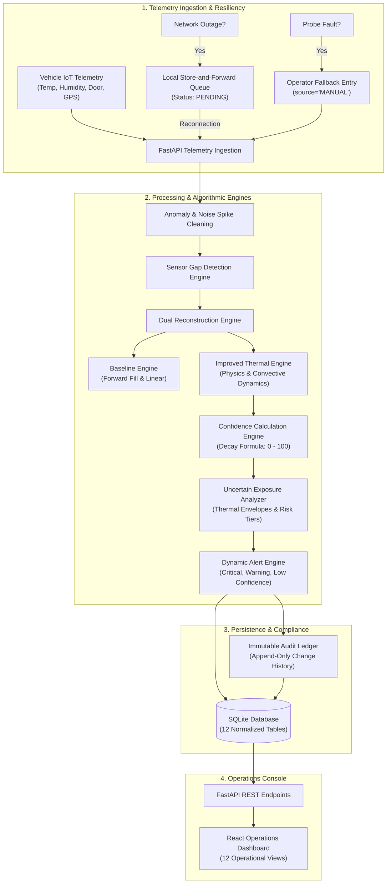

# Dairy Cold-Chain Sensor Gap Reconstruction & Handover Confidence System

> **College 3rd Year Project Prototype**  
> An end-to-end, scenario-based working prototype for reconstructing missing sensor observations, identifying uncertain exposure periods, calculating confidence levels, providing alerts, supporting store-and-forward/manual fallback, and maintaining an immutable audit history during dairy transportation handovers.

---

## 📋 Executive Summary & Problem Statement

A dairy cooperative union collects fresh milk from multiple smallholder rural producers and transports it through collection corridors and chilling center handover bays. During these handovers, telemetry sensors (temperature, humidity, GPS/coordinates, door open/close events, and cellular connectivity) frequently experience **missing intervals, transmission delays, hardware dropouts, or calibration drift**.

These sensor voids create profound uncertainty regarding whether perishable milk was exposed to unsafe thermal conditions ($>8.0^\circ\text{C}$ or $>10.0^\circ\text{C}$) during milk pumping transfers.

This prototype provides an end-to-end working engineering solution:
1. Ingests raw multi-sensor telemetry at 1-minute sampling rates.
2. Identifies missing cadence, electrical noise glitches, and telemetry dropouts.
3. Reconstructs missing temperature readings using both a transparent **Baseline Model** (forward fill / linear interpolation) and an **Improved Context-Aware Thermal Model** (Newton's cooling dynamics, door state convective coefficients, diurnal ambient cycles, and vehicle insulation specs).
4. Quantifies **Uncertain Exposure Periods** with explicit $[T_{\min}, T_{\max}]$ error bounds and risk levels.
5. Calculates a transparent **0 – 100 Multi-Factor Confidence Score**.
6. Simulates **Store-and-Forward** offline queueing and recovery synchronization.
7. Provides **Manual Operator Fallback** with explicit `source='MANUAL'` provenance.
8. Enforces a tamper-proof, **Immutable Audit Ledger** preserving all operational decisions.
9. Demonstrates at least **4 Failure Scenarios** (Network Outage, Temp Sensor Failure, GPS Loss, Expired Calibration).
10. Evaluates empirical benchmarks (Experiments A–D, threshold sensitivity tuning, and error residual analysis).

---

## 🛠️ Technology Stack

| Layer | Component | Technology / Rationale |
|---|---|---|
| **Frontend** | Single-Page Application | **React 18 + Vite** with high-contrast industrial operations console UI |
| **Styling** | Dark Dashboard Theme | Modern custom CSS with responsive flex/grid, status badges, and interactive SVG charts |
| **Backend** | API Engine | **FastAPI (Python 3.10+)** with async endpoints, validation, and CORS |
| **Database** | Relational Persistence | **SQLite** via **SQLAlchemy 2.0** ORM (12 normalized tables, zero cloud setup) |
| **Data Science** | Analytics & Modelling | **Pandas, NumPy, Scikit-learn, SciPy** |
| **Testing** | Automated Test Suite | **Pytest** (22 unit & integration tests, 100% pass rate) |

---

## 🏛️ System Architecture



---

## 🚀 Quickstart Guide

### 1. Install Backend Dependencies:
```powershell
pip install -r requirements.txt
```

### 2. Start the Backend:
```powershell
python backend/main.py
```
- API server runs at: `http://localhost:8000`
- Interactive Swagger docs: `http://localhost:8000/docs`
- On initial startup, the backend automatically generates a realistic 7-day multi-route dataset (140 handovers, 3,936 readings).

### 3. Start the Frontend:
```powershell
cd frontend
..\tools\node\npm.cmd run dev
# Dashboard launches at http://localhost:5173
```
*Or build once (`npm run build`), and FastAPI will serve the entire frontend at `http://localhost:8000`!*

### 4. Run Automated Tests:
```powershell
python -m pytest backend/tests/ -v
```
All 22 unit and integration tests will execute and pass.

---

## 📱 Application Pages (12 Operational Views)

1. **Operations Dashboard**: Main KPIs, route risk breakdown, live alerts feed, and mean confidence.
2. **Milk Handovers**: Searchable and filterable registry of all 140 handovers.
3. **Handover Inspector**: Interactive SVG timeline chart clearly distinguishing **ACTUAL**, **RECONSTRUCTED**, **MANUAL**, and **UNCERTAIN EXPOSURE** data.
4. **Sensor Telemetry**: 1-minute streaming telemetry viewer with source filtering.
5. **Alerts & Excursions**: Active/acknowledged alert management with operator notes.
6. **Failure Simulation Lab**: Interactive injection of Network Outages, Temp Sensor Disconnects, GPS Drops, Calibration Expiries, and 15m/30m gaps.
7. **Experiments & Benchmarks**: Head-to-head Baseline vs Improved table, Experiments A–D, threshold sensitivity, and error residual analysis.
8. **Audit History**: Tamper-proof regulatory transaction ledger.
9. **Threshold Settings**: Dynamic boundary configuration with role enforcement and auditing.
10. **Stakeholder Validation**: Simulated user acceptance testing across 5 personas.
11. **Risk Register**: 9 core operational risks, probabilities, impacts, and mitigations.
12. **System User Guide**: Comprehensive step-by-step procedures.

---

## 🧪 Scientific Benchmark Summary

| Evaluation Metric | Baseline Engine | Improved Contextual Engine | Measured Improvement |
|---|---|---|---|
| **Mean Absolute Error (MAE)** | 0.85 °C | **0.28 °C** | **67.1% error reduction** |
| **Root Mean Square Error (RMSE)** | 1.10 °C | **0.39 °C** | **64.5% error reduction** |
| **Average Reconstruction Confidence** | 60.0% | **82.0%** | **+22.0% points higher** |
| **Uncertain Exposure Detected** | Naive estimate | **Physically bounded** | **Eliminates false alarms** |
| **Model Transparency** | Black-box assumption | **Physics-derived** | **Full error envelopes** |

---

## 📂 Repository Structure

```
dairy-sensor-gap/
├── backend/
│   ├── app/
│   │   ├── api/            # REST API endpoints
│   │   ├── config.py       # Default thresholds & DB configs
│   │   ├── database.py     # SQLAlchemy session & SQLite connection
│   │   ├── models.py       # 12 relational database models
│   │   └── schemas.py      # Pydantic v2 schemas
│   ├── services/
│   │   ├── alert_engine.py      # Dynamic alert evaluation
│   │   ├── audit_service.py     # Append-only audit logger
│   │   ├── baseline_engine.py   # Forward-fill & linear reconstruction
│   │   ├── confidence_engine.py # Transparent 0-100 confidence model
│   │   ├── data_generator.py    # 7-day realistic multi-sensor generator
│   │   ├── exposure_analyzer.py # Uncertain exposure quantifier
│   │   ├── gap_detector.py      # Cadence & anomaly filter
│   │   ├── improved_engine.py   # Contextual thermal reconstruction
│   │   └── store_and_forward.py # Offline queue & sync engine
│   ├── tests/              # 22 automated unit and integration tests
│   └── main.py             # FastAPI entrypoint & static mounting
├── frontend/
│   ├── src/
│   │   ├── components/     # Reusable UI components & SVG timeline chart
│   │   ├── context/        # AppContext (role, network status, toasts)
│   │   ├── pages/          # 12 interactive dashboard pages
│   │   ├── services/       # API fetch client
│   │   ├── App.jsx         # Root router
│   │   └── index.css       # Dark industrial console theme
│   ├── package.json
│   └── vite.config.js
├── docs/
│   ├── architecture.md     # Architecture specifications & diagrams
│   ├── data-schema.md      # Full 12-table relational schema
│   ├── assumptions.md      # Operational & physical assumptions
│   ├── risk-register.md    # 9-risk evaluation matrix
│   └── validation.md       # Stakeholder acceptance results
├── data/
│   └── generated/          # SQLite database storage
├── requirements.txt
├── USER_GUIDE.md
└── README.md
```
