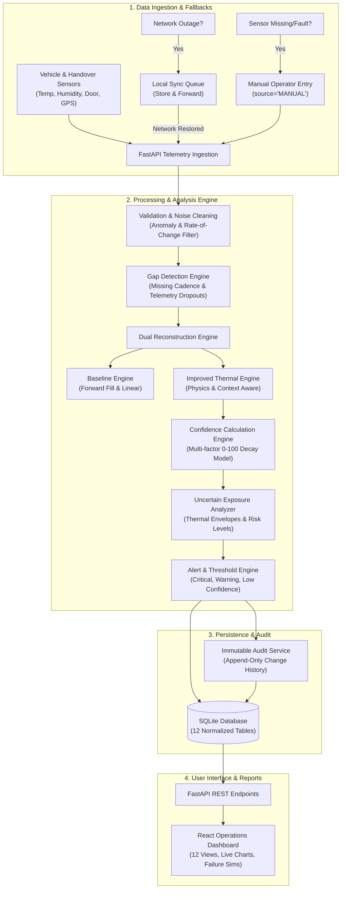

# System Architecture & Technical Specifications

## Dairy Cold-Chain Sensor Gap Reconstruction & Handover Confidence System

This document details the architectural design, algorithmic workflows, fallback mechanisms, and operational components of the prototype.

---

## 1. End-to-End System Flow

---

## 2. Core Architectural Subsystems

### 2.1 Dual Reconstruction Subsystem
1. **Baseline Reconstruction**:
   - Uses zero-context forward fill and naive linear interpolation.
   - Assumes constant temperature between observation points.
   - Generates simple linear uncertainty bounds and basic exposure times.
2. **Context-Aware Improved Reconstruction**:
   - Implements Newton's Law of Cooling coupled with door telemetry:
     $$\frac{dT}{dt} = k_{\text{door}} \cdot (T_{\text{ambient}}(t) - T) - k_{\text{chiller}} \cdot (T - T_{\text{setpoint}})$$
   - Computes dynamic ambient diurnal temperatures based on timestamp.
   - Adjusts for vehicle insulation specifications ($R$-value) and cargo humidity.
   - Generates explicit upper and lower temperature envelopes $[T_{\min}, T_{\max}]$.

### 2.2 Confidence Scoring Engine (0 – 100)
The confidence score is formulated multiplicatively:
$$\text{Confidence} = 100 \times w_{\text{duration}} \times w_{\text{calibration}} \times w_{\text{gps}} \times w_{\text{door}} \times w_{\text{network}} \times w_{\text{cross-sensor}} \times w_{\text{noise}}$$

- **Temporal Decay ($w_{\text{duration}}$)**: $e^{-0.035 \cdot \Delta t_{\text{gap}}}$. Gaps under 5 min retain $>84\%$ confidence, while gaps exceeding 30 min decay to $<35\%$.
- **Calibration Factor ($w_{\text{calib}}$)**: Valid = $1.00$, Warning = $0.85$, Expired = $0.55$.
- **GPS Availability ($w_{\text{gps}}$)**: Fixed coordinate lock = $1.00$, Fallback = $0.82$.
- **Door Event Certainty ($w_{\text{door}}$)**: Confirmed state = $1.00$, Ambiguous = $0.78$.
- **Network Reliability ($w_{\text{net}}$)**: Online = $1.00$, Buffered = $0.88$.
- **Cross-Sensor Availability**: Full telemetry = $1.00$, Isolated = $0.80$.

Tiers:
- **90–100**: Very High Confidence
- **75–89**: High Confidence
- **50–74**: Medium Confidence
- **< 50**: Low Confidence (Triggers Operations Alert)

### 2.3 Uncertain Exposure Period Quantification
Intervals are flagged when reconstruction confidence drops below $75\%$ or temperature upper bound $T_{\max} \ge 8.0^\circ\text{C}$.
For each block, the system computes:
- Exact start and end timestamps and duration (minutes).
- Mean estimated temperature, minimum possible temperature, and maximum potential temperature excursion.
- Risk level classification:
  - **CRITICAL**: $T_{\max} \ge 10.0^\circ\text{C}$ or mean $T \ge 10.0^\circ\text{C}$
  - **HIGH**: $T_{\max} \ge 8.0^\circ\text{C}$ with confidence $< 50\%$
  - **MEDIUM**: $T_{\max} \ge 8.0^\circ\text{C}$ with confidence $\ge 50\%$
  - **LOW**: Temperature controlled within safe limits but confidence degraded.

### 2.4 Fallback Mechanisms
1. **Network Store-and-Forward**:
   - Outage detected $\rightarrow$ records queued in local SQLite `sync_queue` table with status `PENDING`.
   - Reconnection $\rightarrow$ batch reconciliation, parsed as `SYNCHRONIZED` readings, and logged to audit trail.
2. **GPS Fallback**:
   - Hardware drop $\rightarrow$ system falls back to route waypoint coordinates and tags `location_available=False`.
3. **Manual Fallback**:
   - Handheld thermometer readings entered via UI form.
   - Tagged `source='MANUAL'` with operator name, verification timestamp, and reason.
   - Integrated into handover graphs with distinctive purple diamond markers.

### 2.5 Immutable Audit Trail
Every system action (threshold adjustment, manual input, reconstruction method switch, failure simulation) is appended to the `audit_logs` table with previous value, new value, actor, timestamp, and justification. Records are append-only and never deleted or overwritten.
