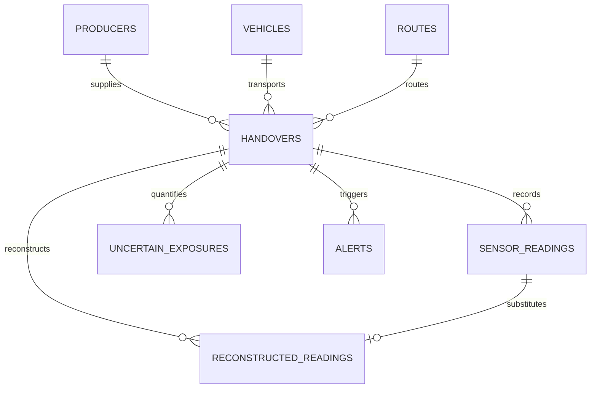

# Database Schema Specification

This document details the relational database schema implemented in SQLite for the **Dairy Cold-Chain Sensor Gap Reconstruction & Handover Confidence System**.

---

## Entity Relationship Overview

---

## 1. Table Definitions

### `producers`
Stores milk producer metadata and geo-coordinates.
| Field | Type | Constraints | Description |
|---|---|---|---|
| `id` | VARCHAR | PRIMARY KEY | Unique producer identifier (e.g. `PROD-01`) |
| `name` | VARCHAR | NOT NULL | Dairy cooperative or farm name |
| `location` | VARCHAR | NOT NULL | Rural region or sector |
| `latitude` | FLOAT | NULLABLE | Decimal degrees |
| `longitude` | FLOAT | NULLABLE | Decimal degrees |
| `contact` | VARCHAR | NULLABLE | Primary dispatcher phone |
| `daily_volume` | FLOAT | DEFAULT 150.0 | Average milk output in liters |

### `vehicles`
Fleet insulated tankers and installed sensing units.
| Field | Type | Constraints | Description |
|---|---|---|---|
| `id` | VARCHAR | PRIMARY KEY | Unique vehicle ID (e.g. `VEH-01`) |
| `vehicle_number` | VARCHAR | NOT NULL | Registration license plate |
| `sensor_id` | VARCHAR | NOT NULL | Master IoT telemetry unit ID |
| `cooling_type` | VARCHAR | DEFAULT 'Active'| Active Refrigeration or Chilled Eutectic |
| `insulation_rating`| VARCHAR | NOT NULL | Polyurethane grade & R-value |
| `capacity_liters` | FLOAT | DEFAULT 5000.0| Tank volume capacity |

### `routes`
Transportation paths between collection centers and processing hubs.
| Field | Type | Constraints | Description |
|---|---|---|---|
| `id` | VARCHAR | PRIMARY KEY | Route code (e.g. `RT-01`) |
| `route_name` | VARCHAR | NOT NULL | Corridor name |
| `start_location` | VARCHAR | NOT NULL | Collection dispatch station |
| `end_location` | VARCHAR | NOT NULL | Chilling terminal or processing plant |
| `distance_km` | FLOAT | NOT NULL | Total path length |
| `expected_duration_min` | INTEGER | NOT NULL | Standard transit time |

### `handovers`
Critical milk transfer and collection events.
| Field | Type | Constraints | Description |
|---|---|---|---|
| `id` | VARCHAR | PRIMARY KEY | Handover ID (e.g. `HO-0001`) |
| `producer_id` | VARCHAR | FOREIGN KEY | References `producers.id` |
| `vehicle_id` | VARCHAR | FOREIGN KEY | References `vehicles.id` |
| `route_id` | VARCHAR | FOREIGN KEY | References `routes.id` |
| `location` | VARCHAR | NOT NULL | Transfer point name |
| `latitude` | FLOAT | NULLABLE | GPS coordinate |
| `longitude` | FLOAT | NULLABLE | GPS coordinate |
| `start_time` | DATETIME | NOT NULL | Arrival & hose connection start |
| `end_time` | DATETIME | NOT NULL | Hose disconnect & departure |
| `duration_minutes`| FLOAT | NOT NULL | Handover duration |
| `milk_volume` | FLOAT | NOT NULL | Transferred volume in liters |
| `status` | VARCHAR | DEFAULT 'COMPLETED' | Status: `COMPLETED`, `WARNING`, `CRITICAL` |
| `overall_confidence`| FLOAT | DEFAULT 85.0 | Average confidence (0 - 100) |
| `risk_level` | VARCHAR | DEFAULT 'LOW' | `LOW`, `MEDIUM`, `HIGH`, `CRITICAL` |

### `sensor_readings`
Time-series raw telemetry stream (1-minute resolution).
| Field | Type | Constraints | Description |
|---|---|---|---|
| `id` | INTEGER | PRIMARY KEY AUTO | Unique sequence ID |
| `timestamp` | DATETIME | NOT NULL, INDEX | Observation time |
| `handover_id` | VARCHAR | FOREIGN KEY, INDEX| Handover event link |
| `vehicle_id` | VARCHAR | NOT NULL | Tanker ID |
| `temperature` | FLOAT | NULLABLE | Chilled milk temperature (°C) |
| `humidity` | FLOAT | NULLABLE | Relative ambient humidity (%) |
| `door_status` | VARCHAR | DEFAULT 'CLOSED' | `OPEN`, `CLOSED`, `UNKNOWN` |
| `door_event` | VARCHAR | DEFAULT 'NONE' | `OPENED`, `CLOSED`, `NONE` |
| `network_status`| VARCHAR | DEFAULT 'ONLINE' | `ONLINE`, `OFFLINE`, `DEGRADED` |
| `sensor_status` | VARCHAR | DEFAULT 'OK' | `OK`, `FAULT`, `UNAVAILABLE`, `DRIFT` |
| `calibration_status`| VARCHAR | DEFAULT 'VALID'| `VALID`, `EXPIRED`, `WARNING` |
| `battery_status`| FLOAT | DEFAULT 95.0 | Telemetry unit battery % |
| `location_available`| BOOLEAN | DEFAULT TRUE | GPS satellite lock |
| `source` | VARCHAR | DEFAULT 'ACTUAL' | `ACTUAL`, `MANUAL`, `FALLBACK`, `SYNCHRONIZED` |
| `is_noisy` | BOOLEAN | DEFAULT FALSE | Outlier spike flag |
| `is_delayed` | BOOLEAN | DEFAULT FALSE | Arrived with transmission latency |

### `reconstructed_readings`
Reconstructed records for missing intervals.
| Field | Type | Constraints | Description |
|---|---|---|---|
| `id` | INTEGER | PRIMARY KEY AUTO | Record ID |
| `sensor_reading_id`| INTEGER | NULLABLE | Associated raw slot if exists |
| `handover_id` | VARCHAR | FOREIGN KEY, INDEX| Handover event link |
| `timestamp` | DATETIME | NOT NULL, INDEX | Target timestamp |
| `actual_value` | FLOAT | NULLABLE | Ground truth (for benchmark validation) |
| `reconstructed_value`| FLOAT | NOT NULL | Estimated temperature (°C) |
| `method` | VARCHAR | NOT NULL | `BASELINE_FORWARD_FILL` or `IMPROVED_CONTEXTUAL` |
| `confidence` | FLOAT | NOT NULL | Mathematical score (0 - 100) |
| `source` | VARCHAR | DEFAULT 'RECONSTRUCTED'| Explicit source provenance |
| `reason` | VARCHAR | NOT NULL | Transparent algorithmic rationale |
| `lower_bound` | FLOAT | NULLABLE | Minimum expected temperature |
| `upper_bound` | FLOAT | NULLABLE | Maximum potential excursion |

### `uncertain_exposures`
Quantified periods of temperature uncertainty.
| Field | Type | Constraints | Description |
|---|---|---|---|
| `id` | INTEGER | PRIMARY KEY AUTO | Record ID |
| `handover_id` | VARCHAR | FOREIGN KEY, INDEX| Handover event link |
| `start_time` | DATETIME | NOT NULL | Inception of uncertainty window |
| `end_time` | DATETIME | NOT NULL | Conclusion of uncertainty window |
| `duration_minutes`| FLOAT | NOT NULL | Elapsed exposure time |
| `estimated_temperature`| FLOAT | NOT NULL | Mean temperature estimate (°C) |
| `min_possible_temperature`| FLOAT | NOT NULL | Lower confidence bound |
| `max_possible_temperature`| FLOAT | NOT NULL | Peak potential excursion (°C) |
| `confidence` | FLOAT | NOT NULL | Mean window confidence |
| `risk_level` | VARCHAR | DEFAULT 'MEDIUM' | Hazard tier: `LOW`, `MEDIUM`, `HIGH`, `CRITICAL` |

### `alerts`
Configurable operational alerts.
| Field | Type | Constraints | Description |
|---|---|---|---|
| `id` | INTEGER | PRIMARY KEY AUTO | Alert ID |
| `handover_id` | VARCHAR | NULLABLE | Related handover |
| `timestamp` | DATETIME | NOT NULL | Event trigger time |
| `alert_type` | VARCHAR | NOT NULL | `CRITICAL_TEMPERATURE`, `LONG_SENSOR_GAP`, etc. |
| `severity` | VARCHAR | DEFAULT 'WARNING' | `INFO`, `WARNING`, `CRITICAL` |
| `value` | FLOAT | NULLABLE | Observed or calculated metric value |
| `threshold` | FLOAT | NULLABLE | Applied limit boundary |
| `message` | VARCHAR | NOT NULL | Human-readable explanation |
| `status` | VARCHAR | DEFAULT 'ACTIVE' | `ACTIVE`, `ACKNOWLEDGED`, `RESOLVED` |
| `acknowledged_by`| VARCHAR | NULLABLE | Operator name |
| `acknowledged_at`| DATETIME | NULLABLE | Timestamp of acknowledgement |

### `audit_logs`
Immutable change ledger.
| Field | Type | Constraints | Description |
|---|---|---|---|
| `id` | INTEGER | PRIMARY KEY AUTO | Audit ID |
| `timestamp` | DATETIME | NOT NULL, INDEX | Action time |
| `user` | VARCHAR | NOT NULL | Actor (Operator, Lead, System) |
| `action` | VARCHAR | NOT NULL | `UPDATE_ALERT_THRESHOLD`, `MANUAL_FALLBACK_ENTRY`, etc. |
| `entity` | VARCHAR | NOT NULL | Target table or component |
| `entity_id` | VARCHAR | NOT NULL | Entity identifier |
| `old_value` | TEXT | NULLABLE | Previous state |
| `new_value` | TEXT | NULLABLE | Updated state |
| `reason` | VARCHAR | NULLABLE | Business or technical justification |
| `reconstruction_method`| VARCHAR | NULLABLE | Applied engine |
| `confidence_before`| FLOAT | NULLABLE | Confidence score prior to change |
| `confidence_after` | FLOAT | NULLABLE | Confidence score after change |

### `sync_queue`
Store-and-forward offline buffer.
| Field | Type | Constraints | Description |
|---|---|---|---|
| `id` | INTEGER | PRIMARY KEY AUTO | Queue ID |
| `timestamp` | DATETIME | NOT NULL | Enqueue time |
| `payload` | TEXT | NOT NULL | Serialized JSON reading payload |
| `status` | VARCHAR | DEFAULT 'PENDING'| `PENDING`, `SYNCHRONIZING`, `SYNCHRONIZED`, `FAILED` |
| `synced_at` | DATETIME | NULLABLE | Reconciliation timestamp |

### `threshold_settings`
Dynamic runtime configuration boundaries.
| Field | Type | Constraints | Description |
|---|---|---|---|
| `id` | INTEGER | PRIMARY KEY AUTO | Setting ID |
| `key` | VARCHAR | UNIQUE, NOT NULL | Setting key (e.g. `temp_warning`) |
| `value` | FLOAT | NOT NULL | Numerical boundary value |
| `unit` | VARCHAR | DEFAULT '°C' | Measurement unit |
| `description` | VARCHAR | NOT NULL | Operational purpose |
| `updated_at` | DATETIME | NOT NULL | Last update timestamp |
| `updated_by` | VARCHAR | DEFAULT 'system' | Last actor |

### `experiments`
Benchmark runs and threshold evaluations.
| Field | Type | Constraints | Description |
|---|---|---|---|
| `id` | INTEGER | PRIMARY KEY AUTO | Run ID |
| `name` | VARCHAR | NOT NULL | Benchmark title (e.g. `Experiment A - 5m Gaps`) |
| `gap_duration` | INTEGER | NOT NULL | Injected gap in minutes (5, 15, 30, 60) |
| `mae` | FLOAT | NOT NULL | Mean Absolute Error (°C) |
| `rmse` | FLOAT | NOT NULL | Root Mean Square Error (°C) |
| `confidence` | FLOAT | NOT NULL | Average confidence score |
| `uncertain_exposure`| FLOAT | NOT NULL | Total uncertain exposure (min) |
| `alerts_generated`| INTEGER | NOT NULL | Total alerts triggered |
| `false_positives`| INTEGER | NOT NULL | False alarms |
| `false_negatives`| INTEGER | NOT NULL | Missed safety events |
| `precision` | FLOAT | NOT NULL | Precision metric |
| `recall` | FLOAT | NOT NULL | Recall metric |
| `system_type` | VARCHAR | DEFAULT 'IMPROVED' | `BASELINE` or `IMPROVED` |
